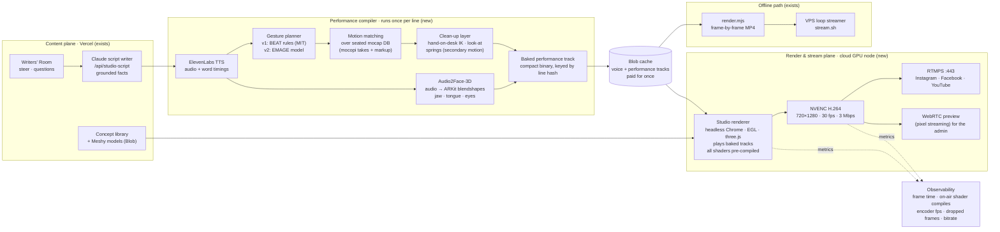
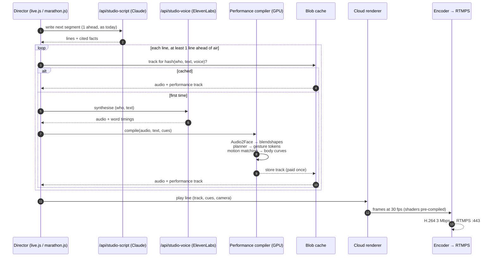
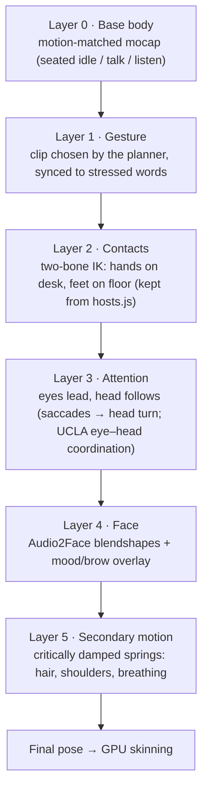

# KARLCON Studio v2: animation and cloud-streaming architecture

*Status: proposal (September 2026). It is based on measurements of the current `/studio`
and on published work. Every figure below is either measured (and labelled as measured) or
cited.*

---

## 1. Verdict: two separate problems

"The presenters lag and look robotic" is really two problems. They have different causes and
different fixes.

| Symptom | Is the animation architecture the cause? | Evidence |
|---|---|---|
| **Lag / stutter / dropped frames** | **No.** The animation code is about 1–4 % of a frame. | Measured (see §2): `hosts.js` costs **0.4 ms/frame at Standard and 1.4 ms at High**, against a 33.3 ms budget at 30 fps. |
| **Robotic, "game-NPC" look** | **Yes.** | The presenters are **procedural**: sine-wave "life" signals, two-bone arm/leg IK, a look-at, gestures picked at random, and mouth shapes guessed from the *text* (TalkingHead rules). There is no motion-capture data for the body and no audio-driven face. When premium voices are off, even the timing is guessed from the text. |

The lag comes from **where** the work runs and **what** is drawn. Three things make it worse:
1. **One consumer PC does everything:** it renders the 3D studio, encodes it in OBS and
   uploads it. The OBS status bar showed **16.5 % dropped frames**, which OBS counts as
   network drops.
2. **Shader compiles on air:** at High quality the studio compiled **13 new GPU programs
   during the first 40 s on air** (measured), at seconds 13 and 20–24, around the first
   close-up. Each compile stalls a frame, and on some drivers the stall is visible.
3. **Pixel cost of the High effects chain** (ambient occlusion, depth of field, reflective
   floor, area lights, bloom). Your PC recorded at **0.16× real time headless and 0.23×
   with `--headed`** (measured on your machine). So it draws a High frame in roughly
   145–210 ms, where live needs 33 ms.

And one configuration issue: your recorder log reports **premium voices off: missing in Vercel →
ELEVENLABS_API_KEY, ELEVENLABS_VOICE_LUMA, ELEVENLABS_VOICE_KARL**. Without them no voices
are recorded, and the lip-sync falls back to timing guessed from the text.

## 2. Measurements

Headless Chromium, 720×1280 (9:16), Episode 1, main-thread CPU profile over 8 s on air (CDP
`Profiler`, 200 µs sampling). The GPU here is software (SwiftShader), so absolute frame
rates are low. What matters is the **share** of main-thread time spent on each part.

| Main-thread time per frame | Standard | High |
|---|---:|---:|
| Avatar animation (`hosts.js`: IK, visemes, gestures, springs) | **0.4 ms** | **1.4 ms** |
| three.js scene update + draw-call submission | 10.1 ms | 20.6 ms |
| Studio director (cues, captions, cameras) | 1.3 ms | 2.4 ms |
| Shader program linking (`getProgramInfoLog` / `getShaderInfoLog`) | 0 | **> 2,000 ms** (blocking waits during the on-air compiles) |
| Main thread idle, waiting on the GPU | 96 % | 46 % |

| Shader programs linked | while loading | during the first 40 s on air |
|---|---:|---:|
| Standard | 70 | **0** |
| High | 87 | **13** |

What this means for the design:
- **Making the animation code faster will not fix the lag.** It is already negligible.
- **The GPU is the bottleneck,** plus shader compiles at High and the upload from home.
  Moving the renderer to a cloud GPU and pre-compiling every shader removes the first two;
  the third is what the cloud's bandwidth fixes.
- **Animation *quality* is a data problem, not a compute problem.** The studios we are
  compared with get their look from **captured performance data selected at runtime**
  (§3), not from more real-time maths.

## 3. What Rockstar and Sony actually do

| Studio | Technique | What it gives them | Source |
|---|---|---|---|
| **Rockstar** (GTA, RDR2) | Performance capture (body mocap + head-mounted face cameras) for authored scenes, layered with **Euphoria** (NaturalMotion): physics simulation of body, muscles and motor control for reactions | Every reaction is different; mocap supplies the acting | Wikipedia: Euphoria; RDR2 development; Rockstar on Euphoria in RDR2 |
| **Sony / Naughty Dog** (The Last of Us Part II) | **Motion matching:** each frame, search a large mocap database for the pose and trajectory that best continue the motion | Film-quality transitions without hand-built state machines | GDC 2021, Mach & Zhuravlov |
| **Ubisoft** (For Honor → La Forge) | Motion matching as "declarative animation": *small markup on top of long mocap takes*; later **Learned Motion Matching** (neural networks replace the search, so memory stays small) | Scales to large libraries | Clavet, GDC 2016; Holden et al., SIGGRAPH 2020 |
| **Sony** (consumer hardware) | **mocopi:** 6-sensor wearable mocap that exports BVH/FBX | Cheap way to build our own seated-presenter library | sony.net mocopi docs |

The shared principle: **quality comes from data captured once, selected and blended at
runtime by a cheap algorithm.** None of these studios solve believable human motion from
scratch every frame, which is what `hosts.js` does now.

## 4. Research that grounds each layer

| Layer | Work | Institution | What we take from it |
|---|---|---|---|
| When to gesture, nod, look away | **BEAT: the Behavior Expression Animation Toolkit** (Cassell, Vilhjálmsson, Bickmore, SIGGRAPH 2001) | MIT Media Lab | Text in, synchronised non-verbal behaviour out. Rules keyed to theme/rheme, emphasis and turn-taking. We already have the text of every line, so BEAT-style rules are the first gesture planner. |
| Face from speech audio | **Audio2Face-3D** (arXiv 2508.16401, 2025), open-sourced with its SDK and training framework | NVIDIA | Audio → skin, jaw, tongue and eye motion. Replaces text-guessed visemes with motion driven by the real ElevenLabs audio. |
| Full-body co-speech gesture | **EMAGE** (CVPR 2024) on the **BEAT2** dataset | MPI-IS, Univ. of Tokyo and others | Audio → face, body, hands; accepts partial gesture hints. The upgrade path from rules to a learned model. |
| Choosing and blending clips | **Motion matching** (Clavet, GDC 2016) → **Learned Motion Matching** (Holden et al., SIGGRAPH 2020) | Ubisoft La Forge, Concordia | A feature-vector search over a mocap library, then inertialised blending. |
| Face rig and eye–head coordination | **Muscle-actuated face model** (Terzopoulos & Waters, 1990) and neuromuscular control of the neck–head–face complex (Lee & Terzopoulos) | UCLA | Why good faces co-activate muscle groups (FACS/ARKit blendshapes, not single visemes) and why eyes lead the head (saccade → head follow). This is our look-at layer's target behaviour. |
| Streaming over real networks | **Pensieve: Neural Adaptive Video Streaming** (Mao, Netravali, Alizadeh, SIGCOMM 2017) | MIT CSAIL | Bitrate must adapt to measured throughput. On our side: a fixed bitrate sized to the link, and moving the uplink from a home connection to a data centre. |
| Rendering in the cloud and streaming pixels | **Unreal Pixel Streaming** (WebRTC + signalling server + GPU instance) | Epic Games | The same pattern for a browser renderer: GPU node → encoder → network, with WebRTC for an interactive preview. |

## 5. Target architecture

### 5.1 System overview



**The one idea behind v2:** everything expensive or data-driven (voice, face, gesture
selection) happens **once per line, ahead of air time**, and is cached, like the voice cache
today. The live renderer only *plays* tracks and draws. It never makes animation decisions
under a frame deadline.

### 5.2 Life of one line



### 5.3 Animation layer stack (what the renderer blends each frame)



The IK, look-at and spring code in `hosts.js` is not thrown away. It becomes layers 2, 3
and 5, applied **on top of** captured motion instead of replacing it.

## 6. Running the render node on a Hugging Face Space

What the docs say (huggingface.co/docs/hub):

| Constraint | Fact | Consequence |
|---|---|---|
| Outbound network | "requests through the standard HTTP and HTTPS ports (80 and 443) along with port 8080. Any requests going to other ports will be blocked." | Plain RTMP on port 1935 **will not work**. Use **RTMPS on 443**, which Instagram and Facebook Live Producer and YouTube (`rtmps://a.rtmps.youtube.com:443/live2`) all offer. |
| Hardware | T4 small $0.40/h · **1× L4 $0.80/h (8 vCPU, 24 GB)** · A10G small $1.00/h | A 20-hour marathon on an L4 costs about $16. |
| Lifecycle | "Upgraded Spaces run indefinitely by default" | Suitable for a 20-hour run. Free CPU Spaces sleep and have no GPU. |
| Disk | 50 GB ephemeral (wiped on restart) | Keep tracks and models in Blob, not on the Space's disk. |
| Plan | Docker Spaces need a PRO / Team plan | Karlissa already runs as a Docker Space, so this is in place. |

**Unknown until tested:** Hugging Face documents GPUs for CUDA workloads. It does not
document whether the container exposes the **graphics** stack (EGL/Vulkan for WebGL in
headless Chrome) or the **NVENC** video encoder. Both are needed for this plan. So step 1
is a one-hour **spike Space** that runs:

```
nvidia-smi                                   # GPU visible?
ffmpeg -hide_banner -encoders | grep nvenc   # hardware encoder visible?
chrome --headless=new --use-gl=egl --enable-gpu --ignore-gpu-blocklist \
       --dump-dom chrome://gpu | grep -i "webgl\|egl"
```
- **All three present:** build the render Space.
- **Graphics or NVENC missing:** use a GPU VM where we control the NVIDIA driver
  capabilities (for example a cloud L4/T4 instance with `NVIDIA_DRIVER_CAPABILITIES=all`),
  with the same container.

**What to reuse from Karlissa** (the uploaded Space): the Docker layout, nginx on :7860 as the
only public port, the `start.sh` process supervisor, the WebSocket live dashboard (becomes the
render node's frame-time and bitrate monitor), and cgroup-aware CPU detection. Its LLM
worker (Ollama phi4-mini, CPU-only) is unrelated to rendering and stays as it is.

## 7. Roadmap, each phase with an acceptance test

| Phase | Work | Accept when |
|---|---|---|
| **P0 · this week** | Add the ElevenLabs keys in Vercel · pre-compile every shader variant at boot (`renderer.compileAsync` with depth of field on, every building shown once) and turn off `checkShaderErrors` in production · live at Standard / 720p / bitrate at most half the measured upload | **0** shader links on air (measured the same way as §2) · OBS dropped frames < 1 % |
| **P1 · 1–2 weeks** | Hugging Face GPU spike (§6), then a render node: headless Chrome on EGL → ffmpeg NVENC → RTMPS :443, with the Karlissa-style dashboard | 60 min at 30 fps with p95 frame time < 33 ms and no encoder drops |
| **P2 · 2–4 weeks** | Performance compiler v1: **Audio2Face-3D** for faces; tracks cached by line hash; renderer plays tracks | Every voice line has an audio-driven face; a repeated line costs no GPU time |
| **P3 · 4–6 weeks** | Record a **seated presenter library with Sony mocopi** (30–60 min: idle, talk, listen, point, nod, sip); markup in Clavet's declarative style; motion matching + BEAT-style planner | Blind A/B: viewers prefer v2 over the current procedural hosts |
| **P4 · later** | Learned gestures (EMAGE) and learned motion matching to shrink the database | Parity with P3 at lower memory, measured the same way |

## 8. What not to do

- **Don't rewrite `hosts.js` for speed.** It is 1–4 % of the frame, so the gain is nil.
- **Don't add Euphoria-style ragdoll physics to seated presenters.** It solves falls and
  impacts, which a seated talk show doesn't have. Springs (layer 5) cover the useful part.
- **Don't broadcast from a browser on the presenting PC.** Render and encode on a GPU node
  in a data centre, or pre-record with `render.mjs`.
- **Don't use free CPU Spaces for rendering.** They have no GPU and go to sleep.

---

## Sources

- Holden, Kanoun, Perepichka, Popa, "Learned Motion Matching", ACM TOG / SIGGRAPH 2020: <https://dl.acm.org/doi/10.1145/3386569.3392440> · <https://theorangeduck.com/media/uploads/other_stuff/Learned_Motion_Matching.pdf>
- Clavet, "Motion Matching and The Road to Next-Gen Animation", GDC 2016: <https://gdcvault.com/play/1023280/Motion-Matching-and-The-Road> · <https://media.gdcvault.com/gdc2016/Presentations/Clavet_Simon_MotionMatching.pdf>
- Mach & Zhuravlov, "Motion Matching in The Last of Us Part II", GDC 2021: <https://gdcvault.com/play/1027118/Motion-Matching-in-The-Last>
- Euphoria (NaturalMotion): <https://en.wikipedia.org/wiki/Euphoria_(software)> · RDR2 development: <https://en.wikipedia.org/wiki/Development_of_Red_Dead_Redemption_2> · <https://wccftech.com/rockstar-euphoria-evolved-rdr2/>
- Cassell, Vilhjálmsson, Bickmore, "BEAT: the Behavior Expression Animation Toolkit", SIGGRAPH 2001 (MIT Media Lab): <https://dl.acm.org/doi/10.1145/383259.383315> · <http://www.ccs.neu.edu/home/bickmore/publications/siggraph2001.pdf>
- Chung et al., "Audio2Face-3D: Audio-driven Realistic Facial Animation for Digital Avatars", arXiv 2508.16401: <https://arxiv.org/abs/2508.16401> · SDK: <https://github.com/NVIDIA/Audio2Face-3D-SDK> · model: <https://huggingface.co/nvidia/Audio2Face-3D-v3.0>
- Liu et al., "EMAGE: Towards Unified Holistic Co-Speech Gesture Generation via Expressive Masked Audio Gesture Modeling", CVPR 2024: <https://openaccess.thecvf.com/content/CVPR2024/html/Liu_EMAGE_Towards_Unified_Holistic_Co-Speech_Gesture_Generation_via_Expressive_Masked_CVPR_2024_paper.html>
- Terzopoulos & Waters, "Physically-Based Facial Modeling, Analysis, and Animation" (UCLA): <http://web.cs.ucla.edu/~dt/papers/vca90/vca90.pdf> · Lee, Sifakis, Terzopoulos, "Comprehensive Biomechanical Modeling and Simulation of the Upper Body", TOG 2009: <http://web.cs.ucla.edu/~dt/papers/tog09/tog09.pdf>
- Mao, Netravali, Alizadeh, "Neural Adaptive Video Streaming with Pensieve", SIGCOMM 2017 (MIT CSAIL): <https://people.csail.mit.edu/alizadeh/papers/pensieve-sigcomm17.pdf>
- Unreal Engine Pixel Streaming: <https://dev.epicgames.com/documentation/en-us/unreal-engine/overview-of-pixel-streaming-in-unreal-engine>
- Sony mocopi developer docs: <https://www.sony.net/mocopi-dev> · BVH export: <https://www.sony.net/Products/mocopi-dev/en/documents/ReceiverPlugin/BVHSender/AboutApp.html>
- Hugging Face Spaces (networking, lifecycle, hardware): <https://huggingface.co/docs/hub/en/spaces-overview> · <https://huggingface.co/docs/hub/spaces-gpus>
- three.js `compileAsync` / shader pre-compilation: <https://threejs.org/docs/pages/Renderer.html> · <https://github.com/mrdoob/three.js/issues/9887>
- Headless Chrome with GPU via EGL: <https://forums.docker.com/t/hardware-acceleration-for-headless-chrome-with-nvidia-gpu/132557>
